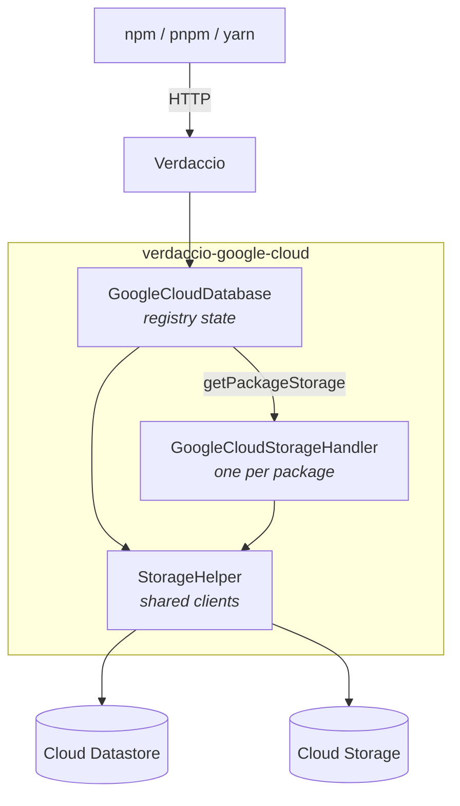
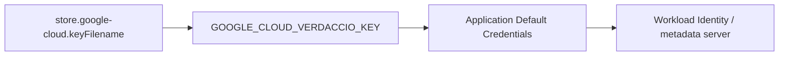
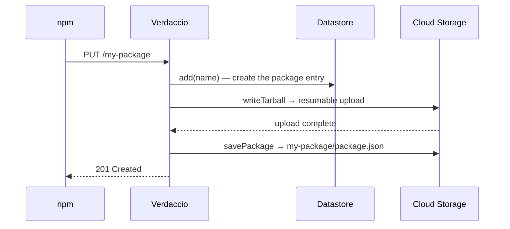
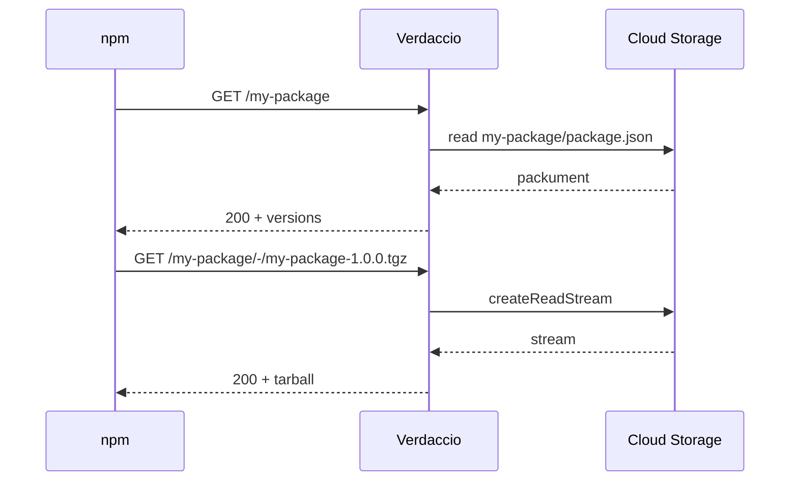
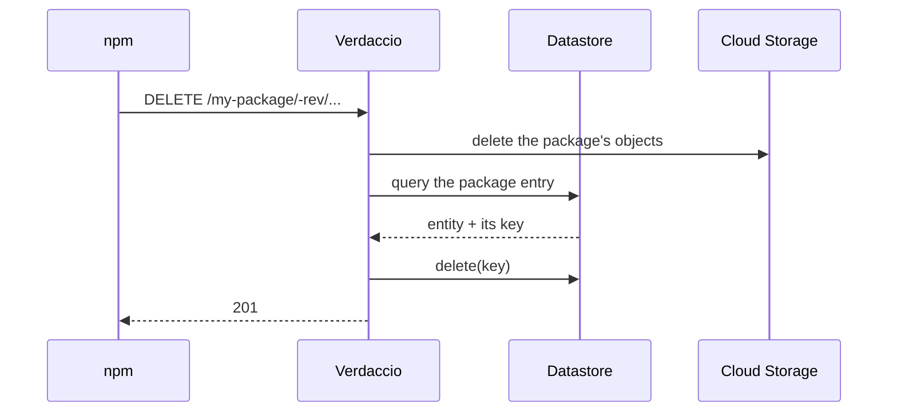
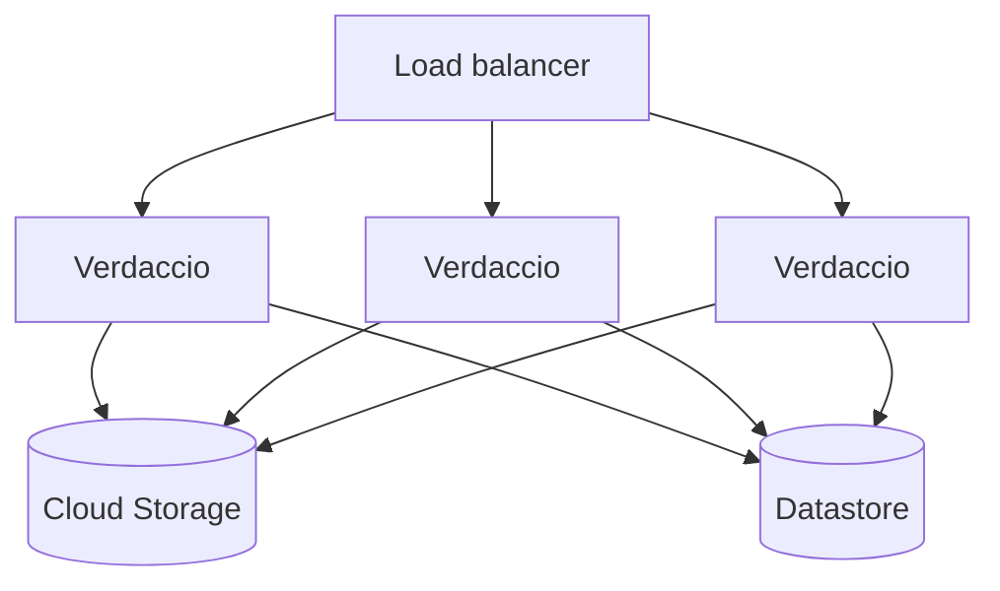
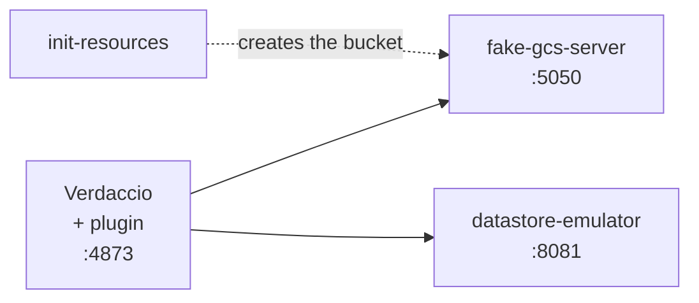

# Architecture and Google Cloud requirements

How `verdaccio-google-cloud` maps a Verdaccio registry onto Google Cloud, and what has to
exist in your project before it will run.

For local development against emulators, see [LOCAL_DEV.md](LOCAL_DEV.md). For the config
reference, see the [README](README.md#configuration).

## What the plugin is

Verdaccio delegates all persistence to a storage plugin. This one splits that work across
two Google Cloud services:

- **Cloud Storage** holds the bytes — every `package.json` and every tarball.
- **Cloud Datastore** holds the registry state — which packages exist, the registry
  secret, and auth tokens.

Nothing is kept on local disk, which is what makes multiple Verdaccio instances able to
share one registry.



`GoogleCloudDatabase` is created once at startup and owns the Datastore and Storage
clients through `StorageHelper`. It hands out a `GoogleCloudStorageHandler` per package,
which is where reads and writes of that package's files happen.

| Component                   | Backed by     | Responsibilities                                                                              |
| --------------------------- | ------------- | --------------------------------------------------------------------------------------------- |
| `GoogleCloudDatabase`       | Datastore     | package list (`add`, `remove`, `get`), `search`, registry secret, auth tokens                 |
| `GoogleCloudStorageHandler` | Cloud Storage | `readPackage`, `savePackage`, `createPackage`, `deletePackage`, `readTarball`, `writeTarball` |
| `StorageHelper`             | both          | holds the configured `Datastore` and `Storage` clients, builds object paths and queries       |

## Google Cloud requirements

### Services

| Service                         | Why                           | How to create                                                                 |
| ------------------------------- | ----------------------------- | ----------------------------------------------------------------------------- |
| Cloud Storage bucket            | tarballs and package metadata | `gsutil mb -p <project> gs://<bucket>`                                        |
| Firestore **in Datastore mode** | registry state                | `gcloud firestore databases create --type=datastore-mode --location=<region>` |

Datastore mode is not optional — the plugin uses the Datastore API (`@google-cloud/datastore`),
not the Firestore native API. A project can only hold one Firestore database mode, so a
project already using Firestore in **native** mode cannot host this registry.

### IAM

The plugin performs exactly these operations, so the permissions follow from them:

| Permission                             | Used by                                          |
| -------------------------------------- | ------------------------------------------------ |
| `storage.objects.get`                  | read metadata and tarballs                       |
| `storage.objects.create`               | publish                                          |
| `storage.objects.delete`               | unpublish, and cleaning up a failed upload       |
| `storage.objects.list`                 | removing a whole package                         |
| `datastore.entities.get`               | secret, tokens                                   |
| `datastore.entities.create` / `update` | register a package, save a token, set the secret |
| `datastore.entities.delete`            | unpublish, revoke a token                        |
| `datastore.indexes.list`               | queries                                          |

The two predefined roles that cover this are **`roles/storage.objectAdmin`** on the bucket
and **`roles/datastore.user`** on the project. Neither grants bucket creation or deletion,
which the plugin never does.

All Datastore queries filter on a single property (`name` on packages, `user` on tokens)
or on none at all, so the **automatic indexes are enough — no `index.yaml` is required**.

### Credentials

Resolved in this order, first match wins:



The project id follows the same shape: `store.google-cloud.projectId`, then
`GOOGLE_CLOUD_VERDACCIO_PROJECT_ID`, then whatever the credentials imply.

On GKE or Cloud Run, set neither — bind a service account and let Application Default
Credentials find it. A key file is for local development.

### Registry configuration

One Verdaccio setting matters beyond the plugin's own block:

```yaml
max_body_size: 100mb
```

The default is 10mb, which rejects larger tarballs before the plugin ever sees them.

## Data layout

### Cloud Storage

Objects are laid out under the package name, with metadata and tarballs side by side:

```
gs://<bucket>/
├── my-package/
│   ├── package.json              ← the full packument
│   └── my-package-1.0.0.tgz
└── @scope/pkg/
    ├── package.json
    └── pkg-2.0.0.tgz
```

There is no separate metadata prefix; the packument is just an object named
`package.json` inside the package's folder.

### Cloud Datastore

| Kind                 | Key                            | Properties                                    | Holds                 |
| -------------------- | ------------------------------ | --------------------------------------------- | --------------------- |
| `VerdaccioDataStore` | **name** = package name        | `name`                                        | one entry per package |
| `Secret`             | **name** = `secret`            | `secret`                                      | the registry secret   |
| `Token`              | **name** = `<user>:<tokenKey>` | `user`, `key`, `token`, `readonly`, `created` | auth tokens           |

Every kind uses a **name key**, never a numeric id. That matters: an entity read back
from a query carries its identifier in `key.name` and leaves `key.id` undefined, so code
that deletes an entity must reuse the key it read rather than rebuild one from an id.

The package kind is configurable with the `kind` option; `Secret` and `Token` are fixed.

## Request flows

### Publish



### Install



Datastore is not touched on the read path — an install only reads objects.

### Unpublish



## Scaling

The plugin holds no local state, so instances are interchangeable:



All instances must share the same bucket, the same Datastore database and the same
registry secret — the secret lives in Datastore, so that one is automatic.

Worth knowing before you rely on it: Verdaccio serialises concurrent writes to a package
**within one process**. Two instances publishing different versions of the same package at
the same moment are not serialised by this plugin, and the last writer wins on
`package.json`.

See the [Helm example](examples/helm/) for a Kubernetes deployment with Workload Identity.

## The emulator stack

CI and local development run the whole thing without touching Google Cloud:



Pointing the plugin at the emulators is what `apiEndpoint` and `datastoreEndpoint` are
for. The compose file wires them through environment variables:

| Variable                             | Points at                     |
| ------------------------------------ | ----------------------------- |
| `GCS_API_ENDPOINT`                   | fake-gcs-server               |
| `DATASTORE_ENDPOINT`                 | the Datastore emulator        |
| `DATASTORE_EMULATOR_HOST`            | read by the Google SDK itself |
| `GCS_BUCKET`, `GOOGLE_CLOUD_PROJECT` | bucket and project names      |

The emulators accept any credentials, so none are configured. `docker compose up` is all
it takes; [LOCAL_DEV.md](LOCAL_DEV.md) covers inspecting the data inside them.

CI additionally runs [`@verdaccio/e2e-cli`](https://www.npmjs.com/package/@verdaccio/e2e-cli)
against this stack — publish, install, ci, audit, info, deprecate, dist-tags, ping, search
and unpublish, with npm and pnpm — plus the Cypress web UI tests.

### Search needs verdaccio 7.0.0-next-7.28 or newer

This plugin implements the **callback-based** storage contract (`get(cb)`,
`add(name, cb)`, and so on). Verdaccio detects that by arity and drives it through
`legacy-storage-adapter.cjs`.

Until `7.0.0-next-7.28` that adapter discarded the search query and passed every item
straight through, so `/-/v1/search` either answered with the whole catalogue whatever
was searched for, or failed outright when the plugin emitted the shape the legacy
contract documents. Both were fixed in
[verdaccio#6279](https://github.com/verdaccio/verdaccio/pull/6279): the adapter now
filters on the query text and normalises the item shape, for this plugin and for every
other callback-based one.

On an older 7.x, search misbehaves in exactly that way and nothing in this plugin can
work around it.
